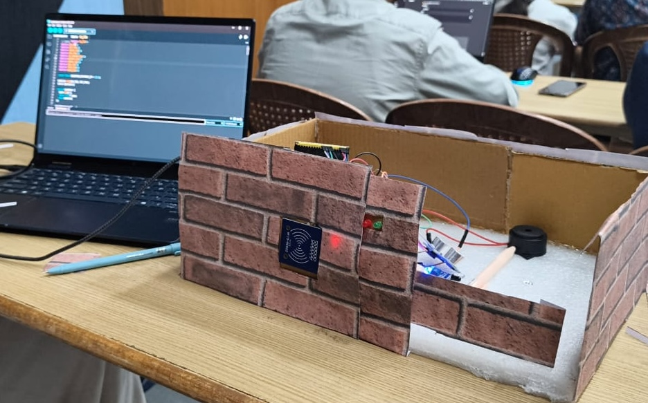
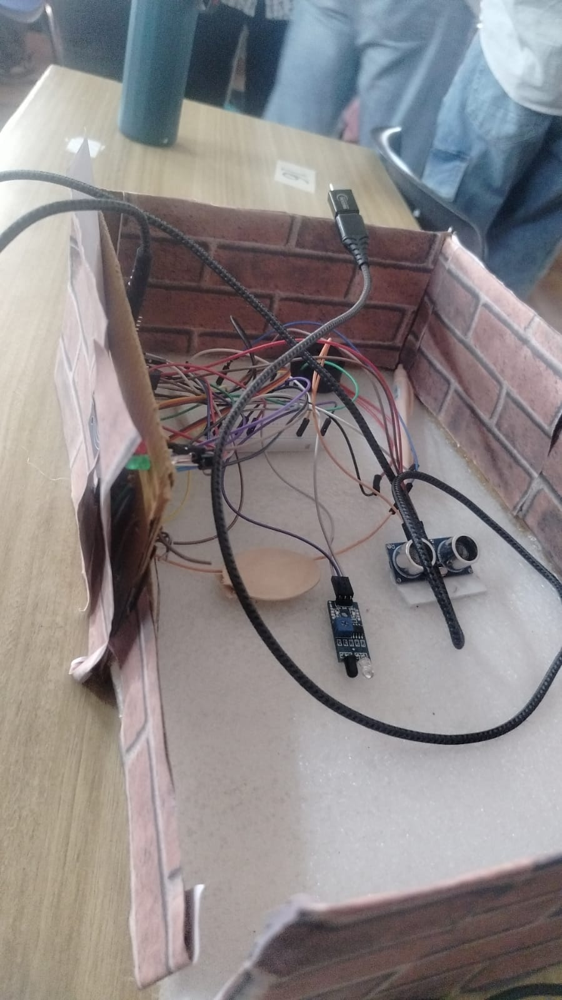

# SmartNavX

> An RFID-based smart navigation and access control system built with Arduino — designed as a physical prototype using everyday materials.

---

## Project Preview

### Front View


### Internal Wiring


---

## Overview

**SmartNavX** is an embedded systems project that combines RFID authentication, ultrasonic sensing, and multi-sensor integration to create a smart entry/navigation system. The prototype is housed in a cardboard enclosure styled with a brick-pattern finish to simulate a real-world wall-mounted unit.

---

## Components Used

| Component | Purpose |
|-----------|---------|
| Arduino (Microcontroller) | Core processing unit |
| RFID Module (RC522 / PN532) | Card-based authentication |
| Ultrasonic Sensor (HC-SR04) | Proximity / distance detection |
| Red & Green LEDs | Access granted / denied indication |
| Buzzer | Audio feedback |
| IR / Motion Sensor Module | Additional detection capability |
| Jumper Wires & Breadboard | Circuit connections |

---

## Features

- **RFID Authentication** — Scan authorized cards/tags to trigger access
- **LED Indicators** — Green for access granted, Red for denied
- **Buzzer Alerts** — Audio cue on authentication events
- **Ultrasonic Proximity Detection** — Detects nearby presence before RFID scan
- **Serial Monitor Integration** — Real-time feedback via USB to laptop

---

## Getting Started

### Prerequisites

- Arduino IDE installed
- Required libraries:
  - `MFRC522` (for RFID)
  - `NewPing` (for ultrasonic sensor)

### Installation

```bash
git clone https://github.com/aniketxai/smartnavx.git
cd smartnavx
```

1. Open the `.ino` file in **Arduino IDE**
2. Install required libraries via **Library Manager**
3. Select the correct **Board** and **COM Port**
4. Upload the sketch to your Arduino

---

## Project Structure

```
smartnavx/
├── src/
│   └── smartnavx.ino       # Main Arduino sketch
├── images/
│   ├── image1.jpeg         # Front view of prototype
│   └── image2.jpeg         # Internal wiring
└── README.md
```

---

## Circuit Diagram

> Connect components as follows:

- **RFID (RC522)** — SPI pins (SS=10, RST=9, MOSI=11, MISO=12, SCK=13)
- **Ultrasonic (HC-SR04)** — Trig=7, Echo=6
- **Green LED** — Pin 4 (with 220 ohm resistor)
- **Red LED** — Pin 3 (with 220 ohm resistor)
- **Buzzer** — Pin 5

---

## How It Works

1. Ultrasonic sensor detects presence within a threshold distance
2. System prompts for RFID scan (LEDs indicate standby)
3. User taps RFID card/tag on the scanner
4. Arduino checks UID against stored authorized UIDs
5. If authorized — Green LED + buzzer beep (access granted)
6. If unauthorized — Red LED + long buzzer tone (access denied)
7. All events are logged to the Serial Monitor in real time

---

## Author

**Aniket** — [@aniketxai](https://github.com/aniketxai)

---

## License

This project is open-source and available under the [MIT License](LICENSE).

---

> *Built with cardboard, and a lot of jumper wires.*
